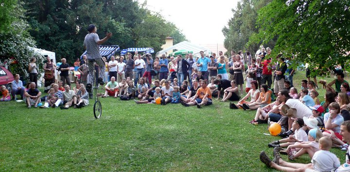

<small><i>Žonglér Erik.</i></small>

## 2013 - třetí ročník
- Karel K a Pepa
- máme název vrátit zpět
- povoděň
- Gadžo bez playerů
- Voda nás nezlomí

## 2014

- Veve
Plakát jsem dotáhl k dokonalosti a tak už mě nikdy plakát dělat nenechali
všichni mají svoje místo - Dan odpadky a sbírání vajglů

## 2015

Voices (vokální skupina), Voila! - shanson/jazz ,BBQ - smyčcový nářez, The Desperate - indie/rock, Zabelov group - world music, Circus problém - balkanská dechovka, Švihadlo - reggae, Blabuburo - Africké rytmy

Michal knihovník

## 2016

První sobota v červnu, tedy 4. 6. 2016 Festival je koncipován jako rodinný

				Hlavní hudební hvězdou bude desetičlenná skupina Top Dream Company, která zahraje funky s příměsí disco, soulu a R&B. Fanoušky rockabilly obšťastní Twisted Rod. Vasilův Rubáš je zajímavý tím, že dává folku punkovou podobu.

				Hudební žánry se na hlavní scéně budou střídat jako každý rok, nepřijdete ani o balkánskou muziku v podobě formace Romba.

				Dále  se  Vám  představí  Dora  Bondy  a  The Bondages se svým pojetí popu, jazzu, soulu a reggae. Street jazz plný improvizací zahrají Wolfjam. Trojice BomBardák zaujme nejen děti svými písničkami a scénkami o příhodách malého kluka.

				Divadlo Fígl přijede s pohádkou Pinocchio, Dům dětí a mládeže – Stanice techniků se představí lego robotikou a modelářskou dílnou. Zkušení hráči nabídnou bubenický workshop. Unikátní bude podívaná na taekwondo a slackline exhibici, chvíle odpočinku bude možné strávit výtvarným tvořením a lidovými řemesly, festival navštíví i skupina šermířů.

## 2017

Peso se zranil

## 2018
Mikkim
							Producent, muzikant a DJ. Hraje našlápnutý bass music okořeněný prvky ragga, jungle a drum and bassu.

							Romba
												Skupina, která hraje romsko-balkánský, slovenský, polský, ukrajinský, ruský a rusínský repertoár.

												Timudej</h2>
																	Ansámbl, který se pohybuje na rozhraní více hudebních stylů - world music, samby, balkánské muziky, electroswingu, popu či ska.
																	Pavel Vangeli</h2>
								Swingující Marionety - představení, kde loutkař zpívá staré swingové písničky z 30. let a mění hlas dle charakteru postav.
								Nedloubej se v nose</h2>							
								Kapela usmrkánků z Divadla rozmanitosti v Mostě hraje pro všechny malé a velké smrkáče.
								Fígl</h2>							
								Divadlo pro děti s pohádkou O chaloupce z perníku.

## 2019

Koza a Sex Culomets

## 2020

-
