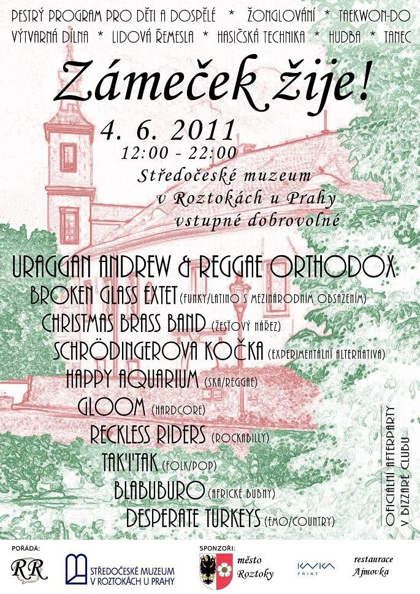
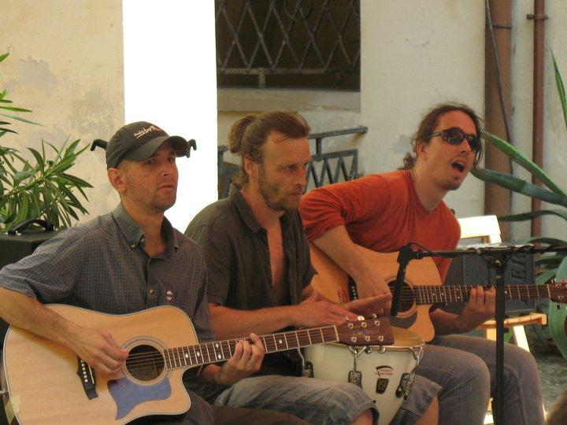
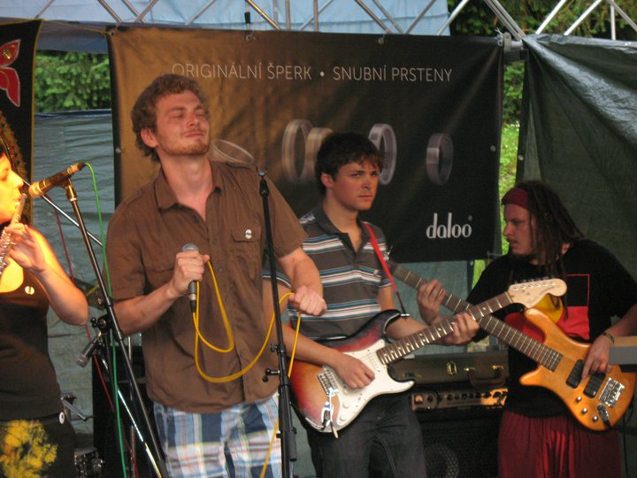
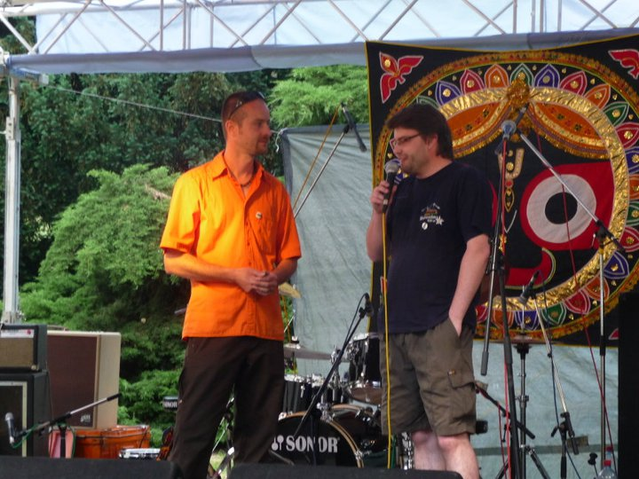
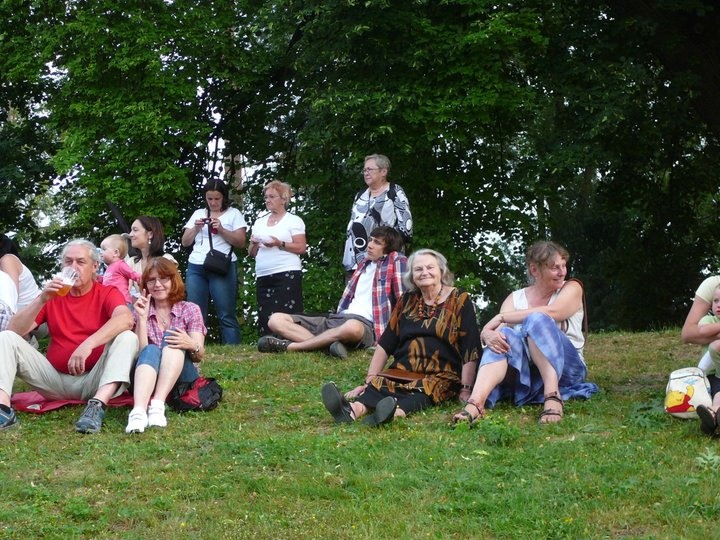
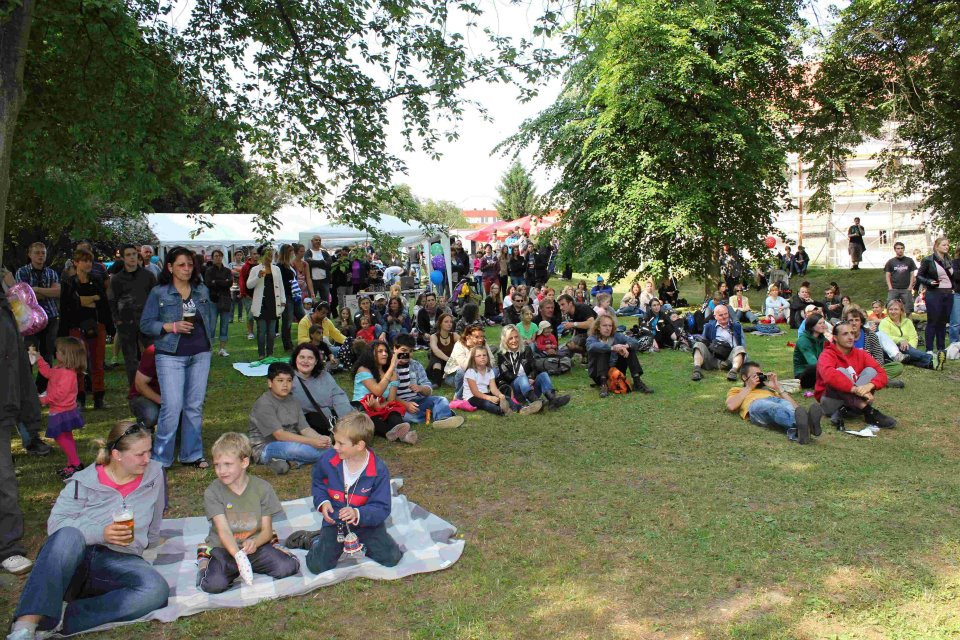
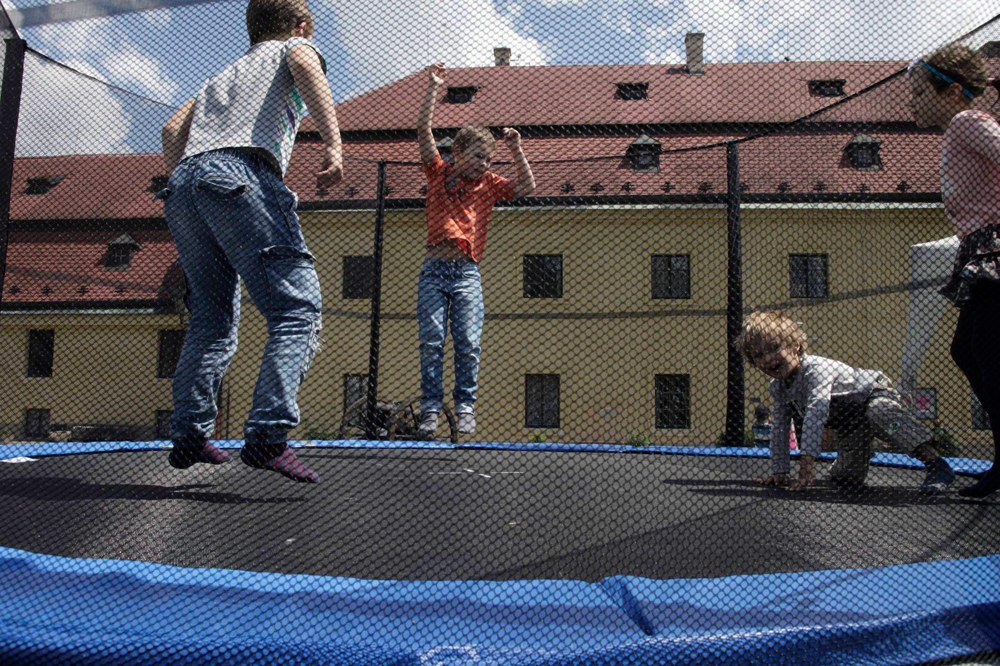

# Historie festivalu Zámeček

## 2011 - první ročník

<small><i>Plakát prvního ročníku festivalu Zámeček.</i></small>

Pojďme se ve vzpomínkách přesunout o téměř deset let zpátky - do roku 2011. Prezidentem byl Václav Klaus, Jiří Kájínek byl ve vězení a Česká televize ještě vysílala analogově - například o havárii v jaderné elektrárně Fukušima nebo o zabití Usámy bin Ládina americkými vojáky. V obchodech se platilo červenou papírovou padesátikorunou, počítačová hra Minecraft ještě neexistovala a Amy Winehouse byla naživu.

V tom roce se v geniální hlavě nechvalně proslulého roztockého muzikanta a učitele v hudebce Václava zrodil nápad na hudební festival, který by se konal dole v Roztokách na zámečku. Měl jsem to štěstí, že jsem v té době hrál s Václavem v kapele Happy Aquarium, a tak jsem byl u všeho od samého začátku. Příležitostí, kde si může taková začínající neznámá kapela zahrát, není mnoho, a tak nápad, že na festivalu vystoupíme i s Akvárkem, je podle mě stejně starý, jako nápad na festival samotný.

Založili jsme občanské sdružení, které jsme pojmenovali záhadným názvem RR. Místopředsedou sdružení se stal Aleš (zpěvák Akvárka), hospodářem a pokladníkem náš kamarád Honza a já se stal předsedou, tedy jsem byl vlastně něco jako ředitel festivalu. Nikdo z nás tehdy nevěděl, co obnáší organizace festivalu. Možná právě proto jsme se do toho pustili s elánem po hlavě a nikdo ani nepomyslel na to, že uspořádat takovou akci není žádná legrace. Říká se, že štěstí přeje začátečníkům a my jsme byli opravdu maximální začátečníci. Festival nám hned na začátku posvětila Marcela ze Středočeského muzea i s paní ředitelkou Zitou a v muzeu náhodou pracoval jako zahradník náš kamarád a perkusionista z Akvárka Dan, takže se zdálo, že nám nic nestojí v cestě. Tedy nic kromě toho, že jsme měli jen jednu kapelu - tu naší.

<small><i>Kapela No Jukebox.  Zakladatel festivalu úplně vlevo.</i></small>

Brzy jsme si uvědomili, že mít jen místo pro konání festivalu a jednu kapelu nestačí. Pokud jste, tak jako my tenkrát, ještě nikdy žádný festival neorganizovali, tak se vám jen ve zkratce pokusím shrnout, co všechno je k tomu potřeba - peníze a čas. A čím méně máte peněz, tím více času vás to bude stát. Začali jsme tehdy zjišťovat, co to vlastně obnáší žádat o grant na kulturu nebo obcházet sponzory s prosbou o finanční dar. Naštěstí se nad námi v kulturní komisi slitovali a přiklepli nám grant ve výši zhruba dvaceti tisíc korun. Sponzorem se stala tiskárna Kavka, která patřila otci našeho kamaráda Vojty, a restaurace Ajmovka, kde jsme tehdy trávili hodně času a kde jsme celý festival také vymysleli.

Festival jsme tenkrát pojmenovali "Zámeček žije!"

<small><i>Kapela Happy Aquarium.  Ředitel festivalu úplně vpravo.</i></small>

Line-up festivalu se brzy zaplnil našimi kamarády a známými. Po delší době jsem viděl svoji bývalou přítelkyni Marinu, která přijela se svojí kapelou Broken Glass Extet. Václav vždy hrál ve více kapelách zároveň, takže si na festivalu zahrál vedle Akvárka ještě s Reckless Riders a s kapelou No Jukebox, která se později přejmenovala na Kosa Vostra. Vystoupila také kapela Schrödingerova kočka, jejíž basák Martin je z Roztok, kapela Gloom roztockého učitele hudební výchovy Viléma a Blabuburo - dnes nepřehlédnutelný spolek roztockých bubeníků, kteří tehdy ale teprve začínali. Jako poslední jsme na plakátu uvedli úplně novou rockovou kapelu našich kamarádů Desperate Turkeys a z legrace jsme u nich jako žánr napsali "emo/country" - kombinace těchto dvou hudebních žánrů nám prostě přišla obzvlášť absurdní a podobné žertíky a recese nám nejsou cizí dodnes.

Plakát jsem tehdy dělal já na notebooku u piva na Ajmovce. Náš kamarád David, který organizuje v Roztokách řemeslné trhy, jej komentoval slovy, že by takový plakát nalákal na akci tak maximálně jeho babičku. Nejsem vůbec žádný výtvarník a plakát byl, eufemisticky řečeno, velmi amatérsky zhotoven, ale na profesionálního grafika jsme neměli peníze a museli jsme zkrátka pracovat s tím, co jsme měli k dispozici.

<small><i>Moderátor festivalu (vlevo)  se starostou Roztok.</i></small>

První Zámeček se konal v sobotu 4. června 2011. Pódium hlavní scény bylo umístěné dole v příkopu vedle tvrze, druhá scéna byla uvnitř na nádvoří. Festival moderoval náš kamarád David - známý roztocký šperkař. Vedle hudby se nám podařilo zajistit i další doprovodný program a drobné atrakce jako například skákací nafukovací hrad od jedné realitní kanceláře, čajovnu s šíšami a koberci stylově umístěnou v parku pod stromy, exhibici roztockého oddílu taekwondo Kwang Myong, ukázku techniky dobrovolných hasičů a vystoupení žongléra Erika, který je Danův kamarád.

Měl jsem na starosti vítání návštěvníků u vstupu na festival, kde jsme hlavně prodávali upomínkové placky na špendlíku, což byl náš velmi důležitý zdroj příjmů, protože vstupné bylo jinak dobrovolné. Bylo moc hezké počasí, vše se dařilo a přišlo mnoho lidí. Protože byla první sobota po Mezinárodním dnu dětí, sešli jsme se v jednom dni s populární roztockou akcí Pohádkový les, a tak přislo hodně dětí s rodiči. Několik lidí se hned při vstupu zmiňuje, že jsou obzvláště zvědaví na tu emo/country kapelu a ptají se mě, co je to za nový žánr. Přišla také Alešova babička, kterou možná nalákal ten můj plakát.

<small><i>Lidé sedí pod stromy.  Uprostřed Alešova babička.</i></small>

Na festival také zavítal jeden nechtěný návštěvník - zaměstanec agentury OSA, který se ihned domáhal mluvit s ředitelem festivalu ohledně zaplacení autorských poplatků. Nikdy nezapomenu, jak se tvářil, když jsem mu se svou dredatou hlavou a drzým úsměvem popravdě oznámil, že ředitelem jsem já.

Štěstí začátečníků nám hrálo do karet a festival se vydařil na výbornou. Lidé se krásně bavili, tančili před pódiem nebo posedávali ve stínu pod stromy a nás hřál samolibý pocit, že to vše jsme pro ně udělali my. Když jsme v neděli večer po vyklizení areálu odpočívali na Ajmovce a vyměňovali si svoje pocity, bylo hned jasné, že to nebyl poslední ročník a že se zrodilo něco nového.

## 2012 - druhý ročník

Povzbuzeni úspěchem prvního ročníku jsme se bez váhání rozhodli uspořádat o rok později festival znovu. Úplně jako první věc jsme ale museli vymyslet nový název. Někomu z vedení Středočeského muzea se totiž zdálo, že název festivalu implikuje, jako by to na zámečku jindy nežilo, což jim přišlo urážlivé. Po dlouhé debatě, během které jsme vymysleli asi tak tři tisíce alternativních názvů a která se protáhla dlouho do noci, jsme nakonec název změnili na "festival Zámeček 2012". Samozřejmě s tím, že každý rok číslo o jedna zvýšíme.

Ten rok jsme se rozešli s Václavem, bohužel ne v dobrém. Naše spory uvnitř kapely a při organizaci festivalu přerostly až do té míry, že další spolupráce nebyla možná. Zašlo to dokonce tak daleko, že jednou mě a Václava museli před Ajmovkou od sebe odtrhávat, abychom si neublížili. Václav se pokusil dělat festival sám, ale Středočeské muzeum chtělo spolupracovat spíš se zbytkem našeho týmu a tak jsme od té doby dělali Zámeček bez něj.

<small><i>Lidé sedí na trávě před hlavní scénou.</i></small>

Kapely jsme opět poskládali z kamarádů a známých, samozřejmě hrálo zase Akvárko, tentokrát už bez Václava, přišli roztočtí taekwondisti Kwang Myong, bubnovalo Blabuburo, moderoval David, žongloval Erik a plakát jsem dělal já - tentokrát si nikdo nedovolil nic namítat, musíme přeci pracovat s tím, co máme. Do party se k nám přidala Alešova kamarádka Veronika, která pomáhala s vítáním návštěvníků a prodejem placek u vstupu. Všichni mě ujistili, že moje dredy a drzost rozhodně nikomu nevadí, ale stejně bude lepší, když nás bude reprezentovat někdo jiný. David se vedle moderování ujal shánění sponzorů a tak jsme ten rok měli rozpočet o něco bohatší.

Hlavní hvězdou byla kapela Bluesberry, jejíž basák Chozé je z Roztok. Strašně nás tehdy nadchnula skupina Vintage Wine, která hraje keltskou, skotskou a irskou muziku v rockovém podání, kluci se do toho umí fakt opřít, nosí skotské sukně a měli taky opravdové dudy, na které tehdy hrál kluk z Roztok. Dan pozval svýho kamaráda Bobana, který hrál písně Boba Dylana a pozvali jsme skáčkovou kapelku Fadžitulikistulán, se kterou jsme se znali ze společného koncertu s Akvárkem.

Velkou a vášnivě diskutovanou změnou bylo přemístění hlavní scény z příkopu nahoru do parku pod stromy. V příkopu totiž není žádná ochrana před sluncem a před pódiem byla při pěkném červnovém počasí taková výheň, že vyhnala z kotle i ty nejzarytější tanečníky.

<small><i>Čínská investiční trampolína.</i></small>

Skákací hrad jsme si ten rok již nepozvali. Namísto toho jsme se rozhodli udělat naší první velkou investici a za peníze ušetřené z prvního ročníku jsme koupili levnou trampolínu čínské výroby, za jejíž použití jsme vybírali deset korun a pomohli tak trochu našemu rozpočtu. Když jsme ale v pátek před festivalem fungl novou trampolínu vysypali z krabice na trávník, zjistili jsme, že ji neumíme postavit. První problém představovalo sestavení ocelové obruče, jejíž jednotlivé části velmi vehementně vzdorovaly sestavení. Druhým, ještě těžším, úkolem bylo natažení skákací plachty na tu obruč. Po dlouhém zkoušení různých způsobů zapojení, šíleném mlácení kladivem a mnoha jadrných nadávkách směřovaných soudruhům do Číny, jsme nakonec těsně před setměním trampolínu konečně sestavili a domluvili se, že příště si naše investice lépe rozmyslíme.

V sobotu šlo všechno už jako na drátkách. Koneckonců neděláme festival poprvé. Počasí opět vyšlo na výbornou, návštěvníků máme víc než loni a kasička s penězi za prodej placek se hezky plní. Jedna věc se ale přeci jen nepovedla, i když ne naší vinou. Kapela Fadžitulikistulán selhala v disciplíně navigace podle mapy a chvíli před zvukovou zkouškou nám zavolali o radu s tím, že budou mít zpoždění, jsou na druhém břehu řeky v Klecanech a nemohou najít most. Snažili jsme se o přeskládání kapel v line-upu, aby mohli zahrát později, ale protože to ani při nejlepší snaze nijak nevycházelo a protože v Roztokách přes řeku žádný most není, museli jsme jejich vystoupení zrušit.

V neděli bouráme pódium, skládáme trampolínu a uklízíme areál. Večer sedíme na pivu na Ajmovce, bolí nás nohy i ruce, ale jsme šťastní a už plánujeme další ročník, který bude určitě ještě lepší. Nakopnuti dalším skvělým úspěchem našeho podniku odvážně spřádáme plány na nejlepší festival, jaký kdy viděl svět.
